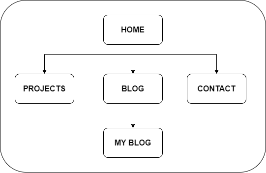
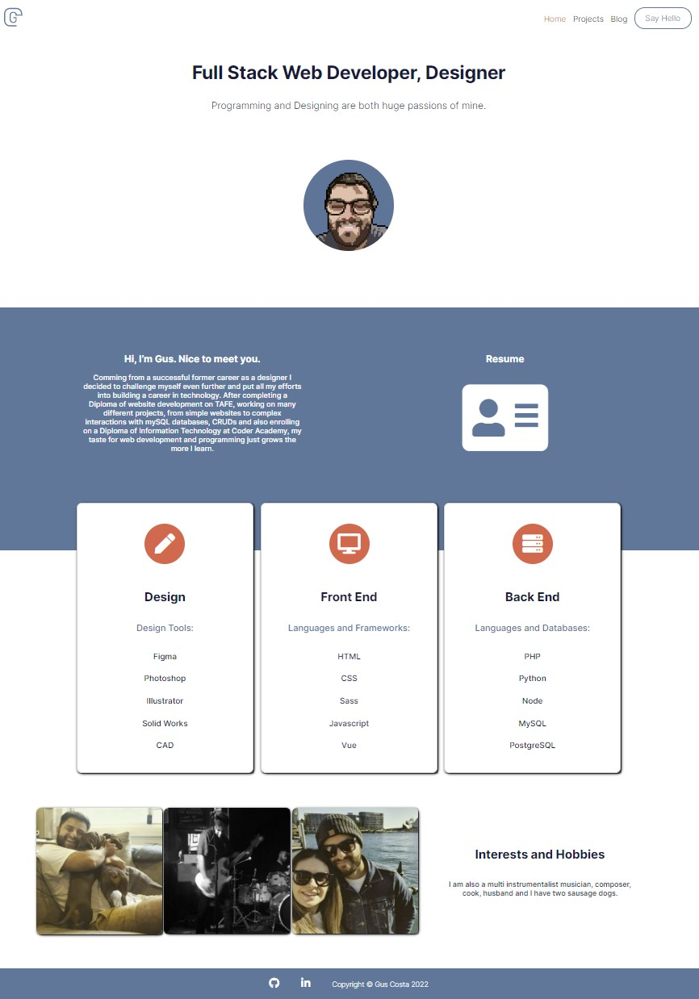
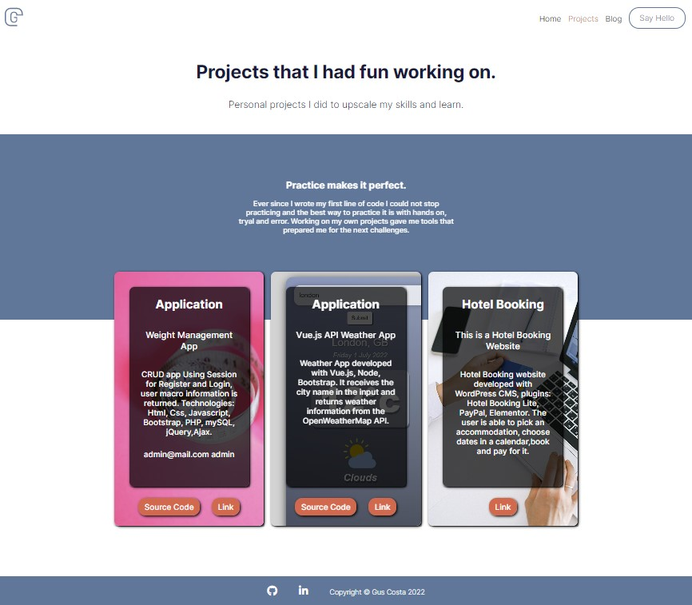
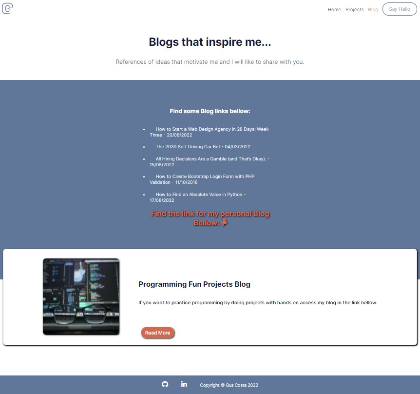
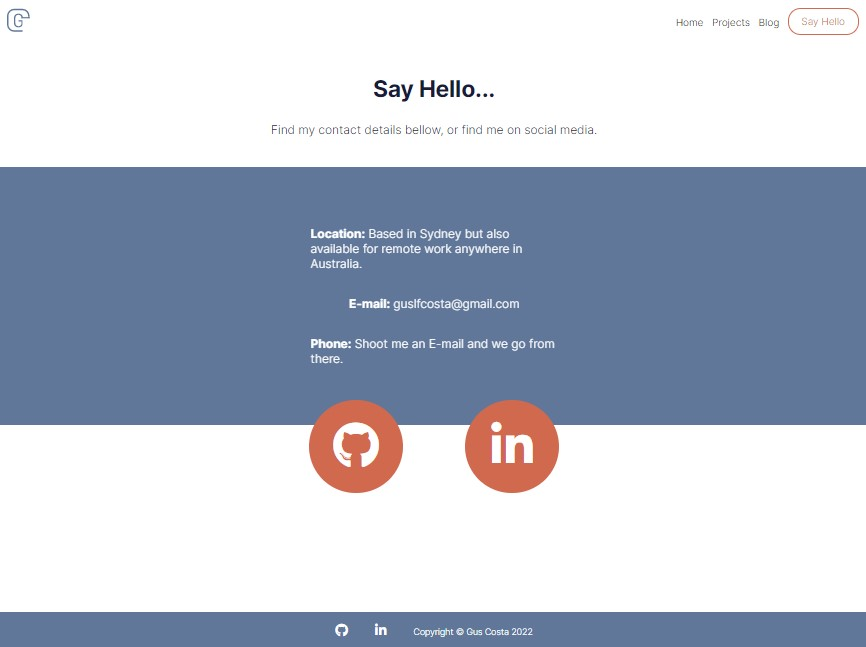

# GusCosta_T1A2

## T1A2 - Portfolio Website

Click [here](https://guscostat1a2.netlify.app/) To open portfolio website.

Click [here](https://github.com/Guscosta88/GusCosta_T1A2) To open Github Repo.

Click [here](https://youtu.be/qFXFjf9qJko) To open my Youtube video showing the whole process.

## **Description:**

### **Purpose:**

#### **What does the site do?**
- It displays information about me.

#### **What problem does it solve?**
- It allows a recruiter or anyone hiring to see my work, skills and learn a bit more about me before our first contact.

#### **what is the main goal?**
- To show that my work and skills are reliable and worthed to get hired.

## **Functionality / features**
- Links to various different pages
- Link to resume
- AOS animations
- Link to Blogs including my own
- hover over reactions
- Information about my personality, skills, contact.

## **Sitemap**

## **Screenshots:**

#### **Home Page**

#### **Projects page**

#### **Blog page**

#### **My Blog page**

#### **Contact page**

## **Target audience:**

- A hiring manager, a possible customer, a recruiter, educators.

## **Tech stack:**

- html 
- Css 
- Javascript Package AOS for animations 
- Github 
- Netlify 
- Ubuntu terminal 